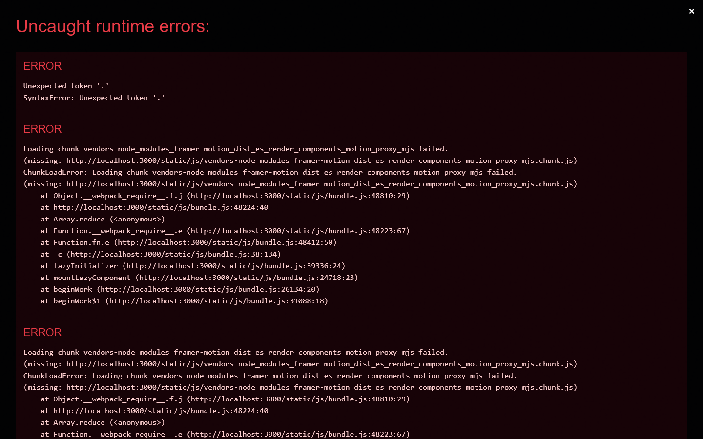

<div align="center">
  <h1>🎯 Career Catalyst</h1>
  <p><strong>AI-Powered Smart Career Path Recommendation System</strong></p>
  <p><i>A beautifully designed, performant React application with immersive 3D experiences.</i></p>
</div>

---

## ✨ Overview

Career Catalyst is an innovative career guidance platform built with React. It provides structured learning roadmaps, curated resources, and an interactive experience to help users navigate their professional journey in domains like **Data Science** and **Web Development**.

The application has been recently upgraded from a basic HTML/CSS/JS stack to a modern **React + 3D UI** architecture, featuring local-storage-backed SQL simulation and high-performance immersive WebGL/CSS 3D components.

---

## 📸 Showcase

Here is a glimpse of the Career Catalyst experience:

### 1. Cinematic Homepage
*Immersive, scroll-driven storytelling with custom WebGL shaders and Particle Text.*


### 2. Career Selection
*Interactive, physics-driven cards using Framer Motion.*


### 3. Interactive Roadmap
*Track your learning progress with an interactive checklist and timeline.*


### 4. AI Resume Analyzer
*Analyze your resume using TensorFlow.js right in your browser.*


---

## 🚀 Key Features

| Feature | Description |
|---|---|
| 🔐 **Authentication** | Secure register & login system backed by a simulated SQL database using localStorage. |
| 🧊 **Immersive WebGL UI** | Custom vertex and fragment shaders for atmospheric backgrounds and particles. |
| 🗺 **Interactive Roadmaps** | Phase-by-phase learning roadmap with progress tracking and checklists. |
| ✨ **Tactile Physics Interactions** | Framer Motion integration for snappy, spring-based micro-interactions. |
| 📚 **Curated Courses** | Carefully selected courses complete with difficulty levels, durations, and direct links. |
| ▶ **YouTube Integration** | Top learning channel recommendations tailored for each career path. |
| 💼 **Interview Prep** | Expandable interview Q&A accordion categorized by technical skills. |
| 📅 **Study Planner** | Interactive weekly task planner with add/complete/delete functionality. |
| ♿ **Hyper-Accessibility** | Keyboard-first navigation, screen-reader optimized, and reduced-motion support. |
| 📝 **Smart Assessment** | Career assessment quiz to recommend the best path based on your skills and interests. |
| ⚡ **Edge-Ready Performance** | Static HTML prerendering, service workers, and visibility-based 3D rendering. |

---

## 🛠️ Tech Stack

- **Frontend:** React 18, React Router v6
- **3D Graphics:** Three.js, React Three Fiber (R3F), CSS 3D Transforms
- **Styling:** CSS Modules, Modern Vanilla CSS (Dark Theme, Glassmorphism)
- **Database:** In-memory SQL schema simulated via localStorage
- **State Management:** React Hooks + Context API

---

## 📂 Project Structure

```text
skillpath/
├── public/
│   └── index.html
├── src/
│   ├── index.js                  ← React entry point
│   ├── App.js                    ← Root app + routing logic
│   │
│   ├── context/
│   │   └── AuthContext.js        ← Global auth state
│   │
│   ├── components/               ← UI Components
│   │   ├── 3d/                   ← 🧊 New 3D Components
│   │   │   ├── AnimatedBackground.jsx
│   │   │   ├── CareerCube3D.jsx
│   │   │   ├── ParticleText3D.jsx
│   │   │   ├── ProgressBar3D.jsx
│   │   │   └── Rotating3DCard.jsx
│   │   ├── assessment/           ← Assessment UI
│   │   ├── ui/                   ← Common UI (LoadingSpinner, etc.)
│   │   ├── CareerLayout.js       ← Sidebar + page switcher
│   │   └── PageHeader.js         ← Reusable page header
│   │
│   ├── pages/                    ← App Views
│   │   ├── AuthPage.js           ← Login & Register
│   │   ├── CareerSelectPage.js   ← Modernized career selection
│   │   ├── RoadmapPage.js        ← Interactive roadmap
│   │   └── ...                   (Courses, YouTube, Interview, Progress)
│   │
│   ├── data/
│   │   ├── db.js                 ← SQL-style in-memory DB
│   │   └── careers.js            ← Career data configurations
│   │
│   └── styles/
│       └── global.css            ← Base styles & variables
│
├── package.json
└── README.md
```

---

## 🗄️ SQL Database Schema (Simulated)

```sql
CREATE TABLE users (
  id         INTEGER PRIMARY KEY,
  name       TEXT NOT NULL,
  email      TEXT UNIQUE NOT NULL,
  password   TEXT NOT NULL,
  created_at TEXT
);

CREATE TABLE sessions (
  id         INTEGER PRIMARY KEY,
  user_id    INTEGER REFERENCES users(id),
  career     TEXT,
  created_at TEXT
);

CREATE TABLE progress (
  id         INTEGER PRIMARY KEY,
  user_id    INTEGER REFERENCES users(id),
  career     TEXT,
  topic      TEXT,
  completed  BOOLEAN DEFAULT FALSE,
  updated_at TEXT
);

CREATE TABLE planner (
  id      INTEGER PRIMARY KEY,
  user_id INTEGER REFERENCES users(id),
  career  TEXT,
  day     TEXT,
  task    TEXT,
  done    BOOLEAN DEFAULT FALSE
);
```

---

## 🛤️ Supported Career Paths

1. **🧠 Data Science**
   - *Topics:* Python, SQL, EDA, Machine Learning, Deep Learning, LLMs, MLOps
2. **🌐 Web Development**
   - *Topics:* HTML/CSS, JavaScript, React, Node.js, Databases, DevOps

---

## 🏃 Getting Started

```bash
# 1. Clone the repository and navigate to the project directory
cd skillpath-react/skillpath

# 2. Install dependencies
npm install

# 3. Start the development server
npm start

# 4. Open your browser
# Navigate to http://localhost:3000 to see the app in action!
```

---

<div align="center">
  <p>Built with ❤️ for a better learning experience.</p>
</div>
